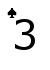
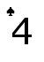
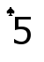
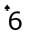
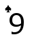
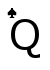
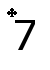
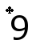

# is-it-shuffled
Does shuffling a deck of cards where some of the cards are set aside mean that you can shuffle less if you then add those cards back in? No! This repo explores why.

What is shuffling and why do we do it?
===
[Shuffling](https://en.wikipedia.org/wiki/Shuffling) is a procedure used to randomize a deck of playing cards. In games where chance is involved, shuffling is necessary in order to prevent any party from influencing the outcome of a card draw.

Take this deck of 10 cards as an example.

